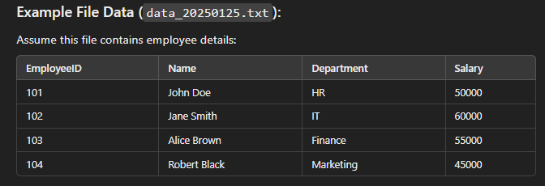
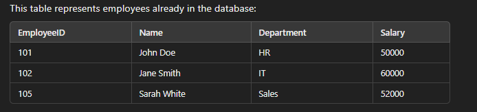
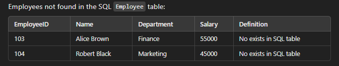

# Requirement:
Process files in a folder whose names start with **"data_"** and end with **".txt"**.
- Example file names: 
  - `data_20250125.txt`, `data_20250126.txt`

### Example Data:

---

### Perform a **Fuzzy Lookup** using a SQL **Employee** table to verify if the data exists in the SQL database.

#### Lookup Table Example:

---

### If the Data Exists:
- Load it into the **SQL Employee** table.

### If the Data Does Not Exist:
- Load it into an **error table** with an additional column **Definition** containing the value `"No exists in SQL table"`.

#### Example Error Table:

****
