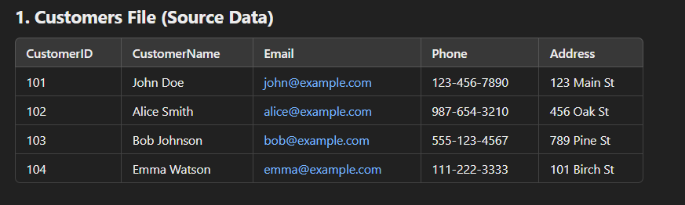
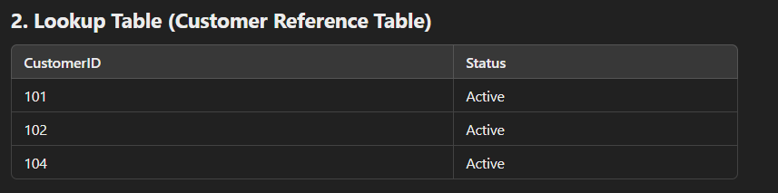
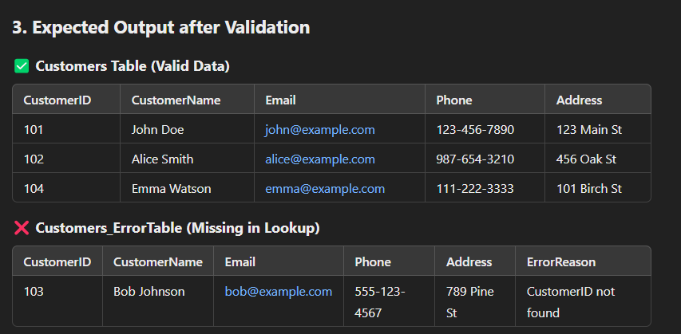

# SSIS Task Overview: Handling Missing Customers & Error Logging

### Task Objective:
- Load a **Customers** file into a **SQL table**.

---

### Validate each **CustomerID** against a **Lookup Table**:
- If **exists**, load into the **Customers Table**.
- If **not exists**, load into the **Customers_ErrorTable**.

---

### Additional Requirements:
- **Send an email notification** listing missing customers.
- Implement an **Event Handler** to capture and log errors.
- Update the **SSISLog Table** with error details.

### SSIS Components to Use:
- **Data Flow Task** → Load and validate **CustomerID** using a **Lookup Transformation**.
- **Conditional Split** → Route missing **CustomerIDs** to **Customers_ErrorTable**.
- **Execute SQL Task** → Insert missing customers into the **Customers_ErrorTable**.
- **Script Task** → Notify about missing customers via email.
- **Event Handler (OnError Event)** → Capture errors, send email with details, and update the **SSISLog Table**.

### Process Flow:
1. Extract data from the **Customers File**.
2. Perform a **Lookup** against the **Customer Reference Table**.
3. Route missing **CustomerIDs** to the **Error Table**.
4. **Send an email notification** listing missing customers.
5. Capture **package errors** via the **Event Handler** and send an email with error details (message, date, package name, runner ID/name).
6. Update the **SSISLog Table** with error details.
