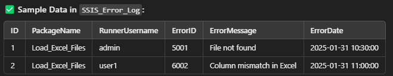
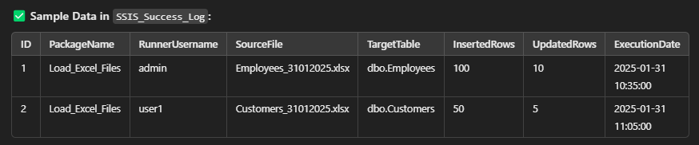

# SSIS Task Overview: Loading Excel Files into an SQL Table with Execution Logging

### **Task Objective:**
You need to create an SSIS package that:
- **Loads multiple Excel files** into a SQL table using a **Foreach Loop Container**.
- Perform **incremental load** to ensure only new or updated records are loaded.
- **Logs errors** (if the process fails) into a dedicated **SQL error log table**.

---

### **Execution Logging:**
- **Logs successful executions** into a separate **SQL success log table**, tracking details like inserted and updated rows.

