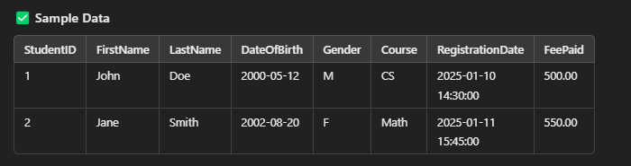
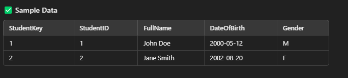
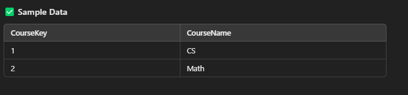
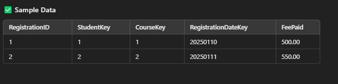

# SSIS Task: Loading Student Registration Data from OLTP to OLAP

### **Overview**
This SSIS package will:
- **Extract student registration data** from an OLTP table.

---

- **Transform the data** (clean, lookup, and aggregate).
- **Load the data** into an OLAP system (Fact & Dimension Tables).

---

### **Dim Tables:**
- **Dim_Student**
- **Dim_Course**

---

### **Fact Table:**
- **Fact_Students_Registration**

---

- **Log Execution Details** (Success/Failure Logs).
