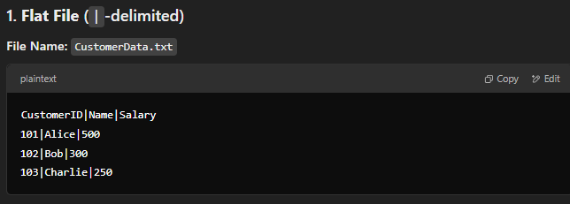
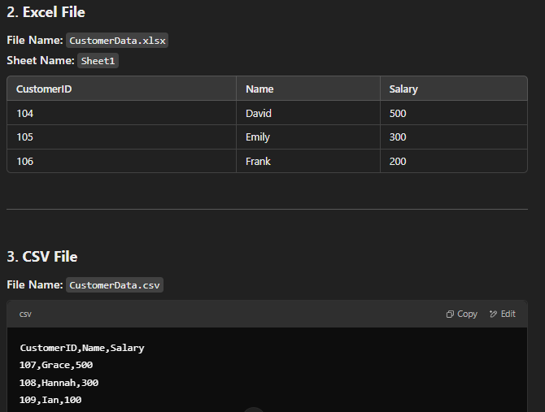

# SSIS Package: Data Integration from Multiple Sources

This SSIS package integrates data from multiple sources (Flat File, Excel, and CSV), performs transformations, and loads the data into a SQL Server table. The package also includes error handling and control flow logic.

---

## 1. **Source Files**

### 1.1 Flat File
- |-delimited data.

### 1.2 Excel File
- Ensure the **Excel driver** is installed if you're using a 64-bit environment.

### 1.3 CSV File
- A standard CSV file.

#### Sample Data

---

## 2. **Target Table**

A SQL table with the required columns:
- `CustomerID`
- `Name`
- `Salary`
- `Position`
- `LoadDate`
- etc.

---

## 3. **SSIS Tasks**

### 3.1 Execute SQL Task
- To check if the target table exists or create it if needed.

### 3.2 Data Flow Task
- To process the three sources and transform the data.

### 3.3 Derived Columns
- `LoadDate`: Current system date/time.
- `Position`: Derived from the Salary column with the given logic.

---

## 4. **Error Handling**

- Add error rows to a separate **error table** or log.

---

## 5. **Control Flow**

- Use **precedence constraints** to proceed only if the table check passes.

---
