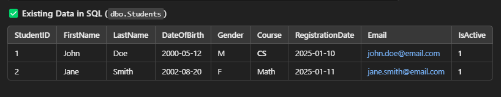
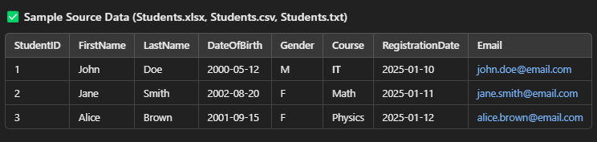
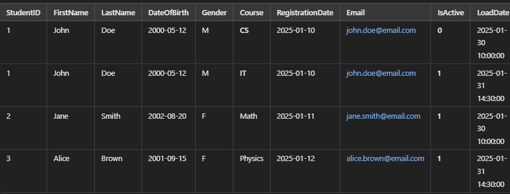

# SSIS Task: Incremental Load Using Slowly Changing Dimension (SCD) Type 0 with IsActive Flag

### **Source Sample Data**

---

### **Existing Target Data**

---

### **Task Overview:**
1. **Extract** data from multiple file sources (Excel, CSV, TXT).
2. **Transform** using:
   - **Lookup** to check for existing records.
   - **Derived Columns** to modify or add new calculated columns.
3. **Load** data incrementally into a SQL table using **Slowly Changing Dimension (SCD) Type 0 with an IsActive flag**:
   - **If the record is new**, insert it with **IsActive = 1**.
   - **If the record exists and has changed**, insert it as a new row and set the previous record's **IsActive = 0**.

---

### **Result:**
The final result should look like this:

