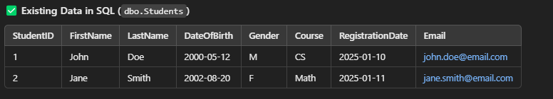
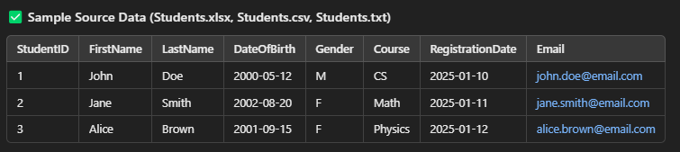

# SSIS Task: Incremental Load (Type 1) for Student Data Using Lookup and Derived Columns

### **Source Files Example:**

---

### **Existing Target Table:**

---

### **Task Overview:**
1. **Extract** data from multiple file sources (Excel, CSV, TXT).
2. **Transform** the data:
   - Use **Lookup** to check for existing records.
   - Use **Derived Columns** to modify or add new calculated columns.
3. **Load** data incrementally into a SQL table:
   - **Insert** new student records.
   - **Update** existing student records if any changes are detected.
