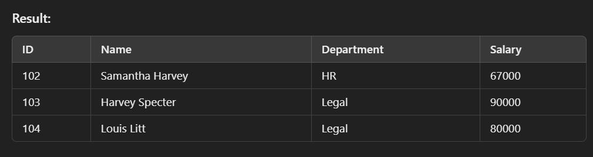

# SSIS Package: Salary Data Processing

This SSIS package performs the following tasks to calculate, filter, and export salary data.

---

## 1. **Calculate Average Salary**

### 1.1 Execute SQL Task
- Use an **Execute SQL Task** to get the average salary from the first table (**SalaryFactTable**) and store it in a variable (`User::AvgSalary`).

### 1.2 Script Task
- Display the value of the variable `User::AvgSalary` using a **Script Task**.

---

## 2. **Filter Salaries**

### 2.1 Execute SQL Task
- Use another **Execute SQL Task** to retrieve salaries greater than the average salary from the second table (**SecondSalaryTable**).
- Store the filtered result in an **Object variable** (`User::FilteredSalaries`).

### 2.2 Script Task
- Display the filtered data using a **Script Task**.

---

## 3. **Export to File**

### 3.1 Data Flow Task
- Write the filtered data to a **CSV file**.
  - The file name should dynamically include the table name and the current date in the format: `SecondSalaryTable_ddMMyyyy.csv`.

---

## 4. **Sample Data and Structure**

### 4.1 Salary Fact Table
### 1. Salary Fact Table (First Table)

| ID | Name           | Age | Salary |
|----|----------------|-----|--------|
| 1  | John Smith     | 30  | 50000  |
| 2  | Jane Doe       | 28  | 60000  |
| 3  | Mike Ross      | 35  | 45000  |
| 4  | Rachel Zane    | 33  | 75000  |
| 5  | Donna Paulsen  | 40  | 85000  |

### 4.2 Second Salary Fact Table
### 2. Second Salary Table (Second Table)

| ID  | Name              | Department | Salary |
|-----|-------------------|------------|--------|
| 101 | Alex Pearson      | IT         | 55000  |
| 102 | Samantha Harvey   | HR         | 67000  |
| 103 | Harvey Specter    | Legal      | 90000  |
| 104 | Louis Litt        | Legal      | 80000  |
| 105 | Sheila Sazs       | Finance    | 60000  |

---

## 5. **Expected Output**

- The result from the **Script Task** and the data in the **destination file** should look like this:

---
